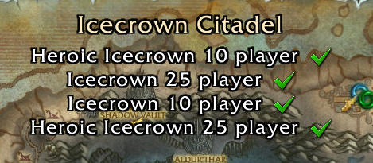
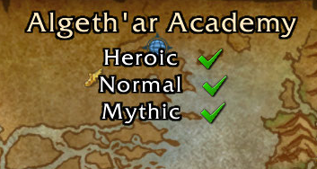

# :world_map: MapAchiever

MapAchiever is a World of Warcraft addon that will show your characters Dungeon and Raid progression on each difficulty by hovering over the Dungeon/Raid icon on the world map.

## :briefcase: Examples

</a>
</a>

## :magnet: Install with CurseForge app

In [CurseForge app](https://download.curseforge.com/), go to `World of Warcraft` and search for `MapAchiever`. Hit the `Install` button.

Or use [this link](https://www.curseforge.com/wow/addons/mapachiever) to access the addon on CurseForge.

## :hammer_and_wrench: Manual Installation
Get [latest release](https://github.com/MattiasMalman/MapAchiever/releases) and move the folder `MapAchiever` from the zip file to this path:

`\World of Warcraft\_retail_\Interface\AddOns`

## :coffee: Buy me a coffee
Donations are welcome to appreciate my work to keep this addon alive, but isn't required at all.

<!-- PayPal icon/button is used from this GitHub repo: https://github.com/andreostrovsky/donate-with-paypal -->

